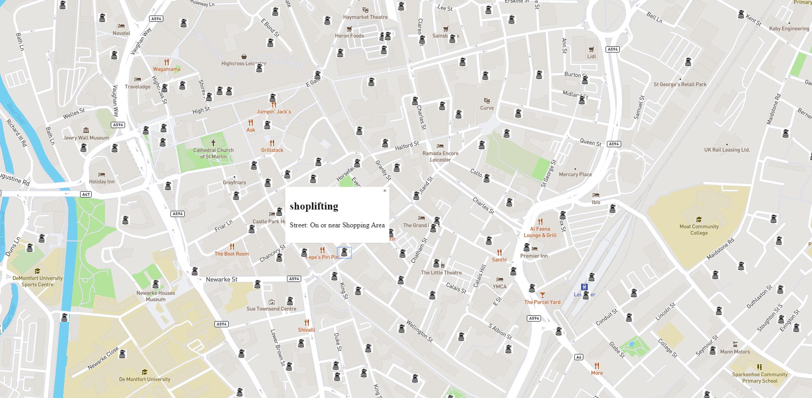

# Crime Map
> This project allows user to search for crime situation in Lanchester in 02.2020
Each of point represent exactly location when a crime was committed.
It uses API from http://mapbox.com/ and http://data.police.uk/

## Table of contents
* [General info](#general-info)
* [Screenshots](#screenshots)
* [Technologies](#technologies)
* [Setup](#setup)
* [Features](#features)
* [Status](#status)
* [Inspiration](#inspiration)
* [Contact](#contact)

## General info
This is my University project.
Show my skills in React and JS

## Screenshots

## Technologies
* React

## Setup
### `npm start`

Runs the app in the development mode. 
Open [http://localhost:3000](http://localhost:3000) to view it in the browser.

The page will reload if you make edits. 
You will also see any lint errors in the console.

### `npm test`

Launches the test runner in the interactive watch mode. 
See the section about [running tests](https://facebook.github.io/create-react-app/docs/running-tests) for more information.

### `npm run build`

Builds the app for production to the `build` folder. 
It correctly bundles React in production mode and optimizes the build for the best performance.

## Features
* Given location
* Given point on map of crime
* Given category and street name

To-do list:
* Wow improvement to be done 1
* Wow improvement to be done 2

## Status
Project is: finished

## Contact
Created by Konrad Ewkiewicz(konrad@ewkiewicz.pl) - feel free to contact me!

